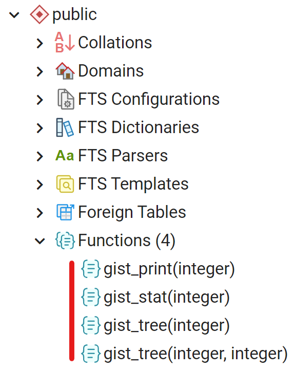
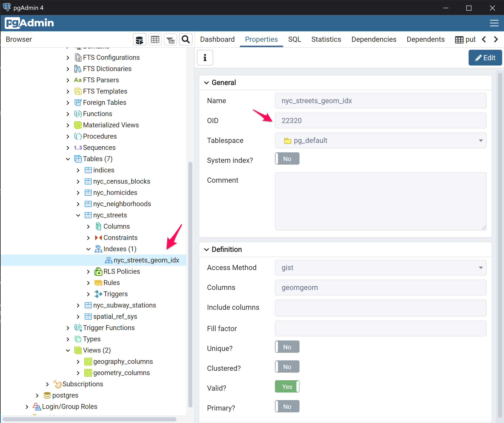

# Visualizing GiST index

## GiST


GiST stands for Generalized Search Tree. It is a balanced, tree-structured access method, that acts as a base template in which to implement arbitrary indexing schemes. B-trees, **R-trees** and many other indexing schemes can be implemented in GiST. For more information, please read the following article: [GiST](http://gist.cs.berkeley.edu/gist1.html).

## Gevel

[Gevel](http://www.sai.msu.su/~megera/wiki/Gevel "Gevel contrib module") contrib module provides several functions useful for analyzing GiST indexes. 

### Install Instructions

You need to have an installation of **_PostgreSQL of version 13_** in order to use this build of gevel extension.

Afterwards place the files that are located in **gevel_ext** folder into respective folders inside PostgreSQL folder.

- `gevel_ext.dll` - Copy it to `C:\Program Files\PostgreSQL\13\lib\`.
- `gevel_ext.sql` - Copy it to `C:\Program Files\PostgreSQL\13\share\extension\` and rename to gevel_ext--1.0.sql.
- `gevel_ext.control` - Copy it to `C:\Program Files\PostgreSQL\13\share\extension\`.

### Usage

1. #### Creating Extension

First, you need to install module into database that contains index you want to analyze. Use this command to create extension:

```sql
DROP EXTENSION IF EXISTS gevel_ext CASCADE;
CREATE EXTENSION gevel_ext;
```

2. #### Getting Index OID

After this you should be able to use the functions from the extension.



These functions do not accept name of the index but its OID. This has advantage that OID identifies index without any ambiguity and doesn't require specifying schemas and such.

You can find OID of index for example through `pgadmin` by selecting the desired index and going into properties. However, it has also disadvantage that OID changes everytime index is recreated - which will be probably done if you are analyzing it.




In that case, it might be more convenient to get OID with SQL, which can be then used when executing function (substitute for `*index_name*` name of your index):

```sql
SELECT CAST(c.oid AS INTEGER) FROM pg_class c, pg_index i 
WHERE c.oid = i.indexrelid and c.relname = '*index_name*' LIMIT 1;

--Example--

SELECT CAST(c.oid AS INTEGER) FROM pg_class c, pg_index i 
WHERE c.oid = i.indexrelid and c.relname = 'sidx_nyc_census_blocks_geom' LIMIT 1
```

| oid   |
|-------|
| 60645 |

You can also use a sql function that I have provided in the queries folder to list all indices with respective OID.

```sql
--After creating the function indices()--
select * from indices();
```

| oid   | index                         |
|-------|-------------------------------|
| 60632 | sidx_nyc_neighborhoods_geom   |
| 60619 | sidx_nyc_streets_geom         |
| 60645 | sidx_nyc_census_blocks_geom   |
| 60628 | sidx_nyc_subway_stations_geom |

#### Using module

Having the OID of the desired index, you can start using the extension. It supports 3 functions:

- **gist_stat(index_oid)** : Prints statistics about the index, such as it's size, number of leaf nodes, etc.
- **gist_tree**(*index_oid*, *max_level*) : Prints index as tree of internal nodes with number of tuples in each page and other data. The depth of tree can be controlled with the second argument.
- **gist_print**(*index_oid*) : Prints actual tuples that create index. For this to work, objects in index must have textual representation (they have to be printable).

#### Examples

> Print statistics about the index.

```sql
select gist_stat(60645);
```

| gist_stat                  |     value |
|----------------------------|----------:|
| Levels                     |         3 |
| Pages                      |       272 |
| Leaf Pages                 |       269 |
| Tuples                     |     39065 |
| Invalid Tuples             |         0 |
| Leaf Tuples                |     38794 |
| Tuples Size _(bytes)_      | 1,097,084 |
| Leaf Tuples Size _(bytes)_ | 1,089,460 |
| Index Size _(bytes)_       | 2,228,224 |

> Print the actual bbox that constitues the index.

```sql
SELECT postgis.st_setsrid(replace(a::text, '2DF', '')::box2d::geometry, 26918)
FROM (
    SELECT * FROM gist_print(60645)
    AS t(level int, valid bool, a postgis.box2df)
    WHERE level = 3)
    AS subq;
```


## Visualizations

To use the python programs. First you need to install `psycopg2` and `pandas` librairies using `pip`.

```bash
pip install psycopg2-binary
pip install pandas
```

You will also need to install [QGIS](https://qgis.org/en/site/forusers/download.html) to display the bounding boxes of GiST index.

### r_tree.py

This clode block allows you to establish connection to your PostgreSQL database.

```python
conn = connect("""
    host=localhost
    dbname=nyc
    user=postgres
    """)
```

Please refer to [Psycopg2](https://www.psycopg.org/docs/usage.html) documentation for how to use this module.

When you first run `r_tree.py`, you will get a list of all the indices with respective OID.

```shell
                       Index     OID
------------------------------------
      nyc_homicides_geom_idx   22318
  nyc_census_blocks_geom_idx   22317
nyc_subway_stations_geom_idx   22321
        nyc_streets_geom_idx   22320
  nyc_neighborhoods_geom_idx   22319


Which GiST index do you want to visualize?
OID →
```

You choose which index to visualize:

```shell
Which GiST index do you want to visualize?
OID → 22320

Number of levels → 3

Level to visualize
↳
```

Then you choose which level.