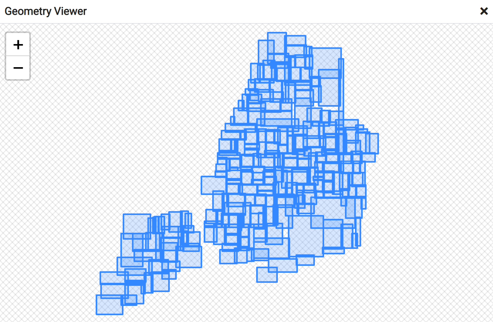

# Visualizing GiST index


## Concepts

### GiST

GiST stands for Generalized Search Tree. It is a balanced, tree-structured access method, that acts as a base template in which to implement arbitrary indexing schemes. B-trees, **R-trees** and many other indexing schemes can be implemented in GiST. For more information, please read the following article: [GiST](http://gist.cs.berkeley.edu/gist1.html).

### Gevel

[Gevel](http://www.sai.msu.su/~megera/wiki/Gevel "Gevel contrib module") contrib module provides several functions useful for analyzing GiST indexes.

## Setup

### Install Instructions

Use the `justfile` in this repository to build and run PostgreSQL + PostGIS +
`gevel` without installing PostgreSQL on your machine.

```bash
just build
just run
just wait-ready
```

Extensions (`postgis` and `gevel`) are enabled automatically on first start via `init.sql`.

### Usage

#### Choosing Index Name

After this you should be able to use the functions from the extension.

- git_stat
- git_tree
- git_print

These functions accept the **index name** as `text` (for example
`'nyc_streets_geom_geom_idx'`).

Use a schema-qualified name to avoid ambiguity when multiple schemas contain
indexes with the same name.

You can list available GiST index names with SQL:

```sql
SELECT n.nspname || '.' || c.relname AS index_name
FROM pg_class c
JOIN pg_namespace n ON n.oid = c.relnamespace
JOIN pg_index i ON i.indexrelid = c.oid
JOIN pg_am am ON am.oid = c.relam
WHERE am.amname = 'gist'
ORDER BY 1;
```

#### Using module

Having the index name, you can start using the extension. It supports 3
functions:

- **gist_stat(index_name)** : Prints statistics about the index, such as it's
  size, number of leaf nodes, etc.
- **gist_tree**(_index_name_, _max_level_) : Prints index as tree of internal
  nodes with number of tuples in each page and other data. The depth of tree
  can be controlled with the second argument.
- **gist_print**(_index_name_) : Prints actual tuples that create index. For
  this to work, objects in index must have textual representation (they have to
  be printable).

#### Examples

> Print statistics about the index.

```sql
select gist_stat('nyc_streets_geom_geom_idx');
```

Number of levels: 2
Number of pages: 124
Number of leaf pages: 123
Number of tuples: 19214
Number of invalid tuples: 0
Number of leaf tuples: 19091
Total size of tuples: 539480 bytes
Total size of leaf tuples: 536024 bytes
Total size of index: 1015808 bytes

> Print the actual bbox that constitues the index.

```sql
SELECT ST_SetSRID(replace(a::text, '2DF', '')::box2d::geometry, 26918)
FROM (
    SELECT * FROM gist_print('nyc_streets_geom_geom_idx')
    AS t(level int, valid bool, a box2df)
    WHERE level = 2)
    AS subq;
```

<p align='center'>
    
</p>

## Visualizations

To use the python programs. First you need to install `psycopg2` and `pandas` librairies using `pip`.

```bash
pip install psycopg2-binary
pip install pandas
```

You will also need to install [QGIS](https://qgis.org/en/site/forusers/download.html) to display the bounding boxes of GiST index.

### r_tree.py

This clode block allows you to establish connection to your PostgreSQL database.

```python
conn = connect("""
    host=localhost
    dbname=postgres
    user=postgres
    """)
```

Please refer to [Psycopg2](https://www.psycopg.org/docs/usage.html) documentation for how to use this module.

When you first run `r_tree.py`, you will get a list of all the indices with respective OID.

```shell
                       Index     OID
------------------------------------
      nyc_homicides_geom_idx   22318
  nyc_census_blocks_geom_idx   22317
nyc_subway_stations_geom_idx   22321
        nyc_streets_geom_idx   22320
  nyc_neighborhoods_geom_idx   22319


Which GiST index do you want to visualize?
OID →
```

You choose which index to visualize:

```shell
Which GiST index do you want to visualize?
OID → 22320

Number of levels → 3

Level to visualize
↳
```

Then you choose which level.
